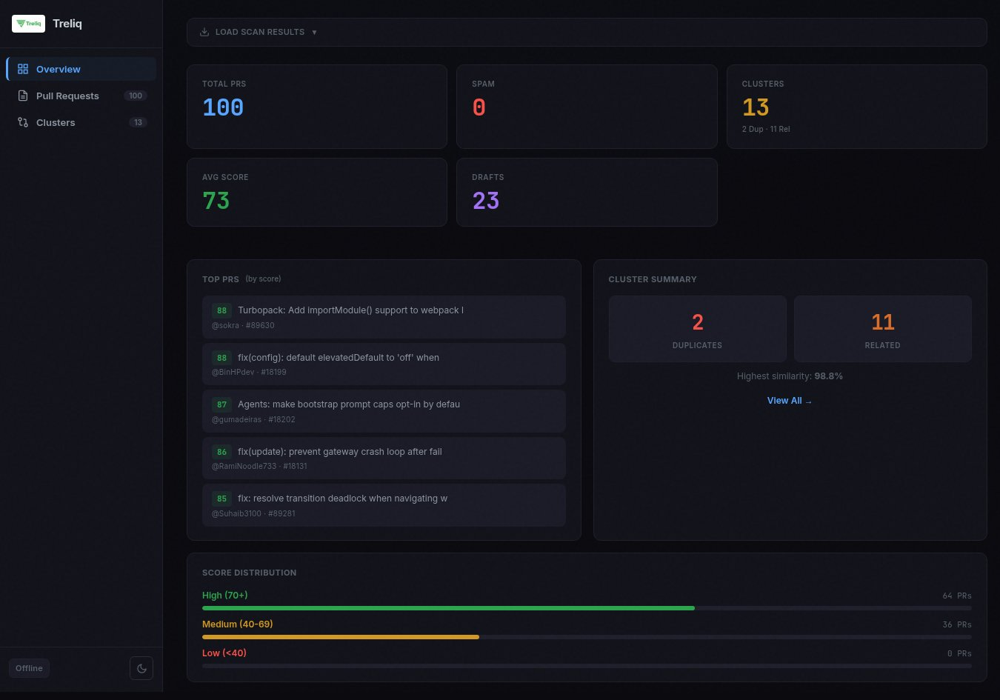
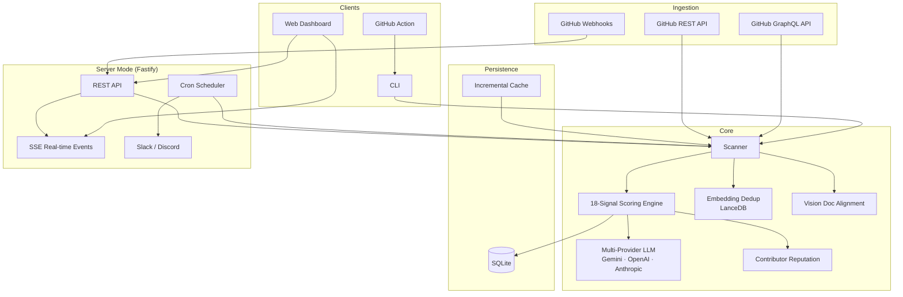

<p align="center">
  
</p>

<h3 align="center">AI-Powered PR Triage for Open Source Maintainers</h3>

<p align="center">
  <em>"3,100 PRs. Which ones should I merge?"</em>
</p>

<p align="center">
  <a href="https://www.npmjs.com/package/treliq"></a>
  <a href="https://www.npmjs.com/package/treliq"></a>
  <a href="https://github.com/mahsumaktas/treliq/actions"></a>
  <a href="LICENSE"></a>
  
  
  <a href="https://github.com/mahsumaktas/treliq/stargazers"></a>
</p>

---

Treliq is an intelligent PR triage system that **deduplicates, scores, and ranks** pull requests so maintainers can focus on merging what matters. Available as a **CLI tool**, **persistent server with REST API**, and **GitHub Action**.

## The Problem

Existing tools review code (CodeRabbit, Greptile, Copilot). None answer the maintainer's real questions:

- **"These 5 PRs fix the same bug — which one is best?"**
- **"Does this PR align with our roadmap?"**
- **"Show me the top 10 PRs I should review today."**

Code Review ≠ PR Triage. Treliq fills the gap.

## What's New in v0.4

- 🖥️ **Server Mode** — Persistent Fastify server with REST API, dashboard UI, and scheduled scanning
- 📡 **Real-time SSE** — Live dashboard updates via Server-Sent Events
- 🔗 **GitHub Webhooks** — Auto-score PRs on open/update/close with HMAC-SHA256 verification
- 🔍 **GraphQL Fetching** — ~80% fewer API calls using GitHub's GraphQL API
- 📊 **18-Signal Scoring** — 5 new signals: draft status, milestone, label priority, CODEOWNERS, requested reviewers
- 🗄️ **SQLite Persistence** — Full scan history, PR state tracking, repository management
- ⚡ **Parallel LLM Scoring** — Concurrency-controlled parallel scoring with configurable limits
- 🚦 **Rate Limit Manager** — Intelligent GitHub API pacing with automatic backoff
- ⏰ **Cron Scheduler** — Automatic periodic scanning with Slack/Discord notifications
- 📢 **Notifications** — Slack and Discord webhook integration for scan results and high-priority PRs

## Dashboard

**[Live Demo →](https://mahsumaktas.github.io/treliq/)**

<p align="center">
  
</p>

- 50 PRs scored and ranked at a glance
- Duplicate cluster visualization
- Spam detection, conflict status, LLM risk assessment
- Dark/light theme toggle

## Architecture



## Quick Start

### CLI Mode

```bash
# Score a single PR
npx treliq score -r owner/repo -n 123 -f markdown

# Scan all open PRs (up to 100)
npx treliq scan -r owner/repo -m 100 -f json

# Find duplicate PR clusters
npx treliq dedup -r owner/repo

# Trust known contributors (exempt from spam detection)
npx treliq scan -r owner/repo --trust-contributors
```

### Server Mode

```bash
# Start server with dashboard on port 4747
npx treliq server -r owner/repo -p 4747

# With webhooks and scheduled scanning
npx treliq server -r owner/repo -p 4747 \
  --webhook-secret $WEBHOOK_SECRET \
  --schedule "0 */6 * * *" \
  --slack-webhook $SLACK_URL

# With multiple scheduled repositories
npx treliq server -r owner/repo -p 4747 \
  --schedule "0 8 * * *" \
  --scheduled-repos "org/repo1,org/repo2"
```

The server exposes:

| Endpoint | Description |
|----------|-------------|
| `GET /` | Dashboard UI |
| `GET /health` | Health check |
| `GET /api/repos` | List tracked repositories |
| `GET /api/repos/:owner/:repo/prs` | List scored PRs (sortable, filterable) |
| `GET /api/repos/:owner/:repo/prs/:number` | Single PR details |
| `POST /api/repos/:owner/:repo/scan` | Trigger a new scan |
| `GET /api/repos/:owner/:repo/scans` | Scan history |
| `GET /api/repos/:owner/:repo/spam` | Spam PRs |
| `GET /api/events` | SSE real-time stream |
| `POST /webhooks` | GitHub webhook receiver |
| `GET /setup` | GitHub App setup guide |

### Multi-Provider LLM

```bash
# Default: Gemini Flash
npx treliq scan -r owner/repo

# OpenAI
npx treliq scan -r owner/repo -p openai --api-key sk-...

# Anthropic (embeddings fall back to Gemini/OpenAI)
npx treliq scan -r owner/repo -p anthropic --api-key sk-ant-...
```

## 18-Signal Scoring

| # | Signal | Weight | Description |
|---|--------|--------|-------------|
| 1 | CI Status | 0.15 | Pass / fail / pending from GitHub Checks |
| 2 | Test Coverage | 0.12 | Whether test files changed alongside code |
| 3 | Merge Conflicts | 0.12 | Mergeable / conflicting / unknown |
| 4 | Contributor Trust | 0.12 | Author association + reputation score |
| 5 | Spam Detection | 0.12 | Tiny diff, docs-only, AI language markers |
| 6 | Draft Status | 0.08 | Draft PRs deprioritized |
| 7 | Review Status | 0.08 | Approved / changes requested / commented |
| 8 | Label Priority | 0.08 | High-priority labels boosted (p0, critical, security) |
| 9 | Milestone | 0.07 | PRs attached to milestones score higher |
| 10 | Diff Size | 0.07 | Lines changed — penalizes extremes |
| 11 | Staleness | 0.07 | Days since opened — fresh PRs preferred |
| 12 | Issue References | 0.07 | Links to issues via `Fixes #123` |
| 13 | CODEOWNERS | 0.05 | Author owns affected code paths |
| 14 | Requested Reviewers | 0.05 | Reviewers assigned signals process maturity |
| 15 | Commit Quality | 0.04 | Conventional commit format |
| 16 | Body Quality | 0.04 | Description length, checklists, screenshots |
| 17 | Activity | 0.04 | Comment count — engagement signal |
| 18 | Breaking Change | 0.04 | Risky files, large deletions, `!:` in title |

When an LLM provider is configured, a **quality score** (0–100) is blended at **60% LLM / 40% heuristic**.

## GitHub Action

```yaml
name: Treliq PR Triage
on:
  pull_request:
    types: [opened, synchronize]
  issue_comment:
    types: [created]

permissions:
  contents: read
  pull-requests: write
  issues: write

jobs:
  triage:
    if: github.event_name == 'pull_request'
    runs-on: ubuntu-latest
    steps:
      - uses: actions/checkout@v4
      - uses: actions/setup-node@v4
        with:
          node-version: 20
      - run: npm install -g treliq@latest
      - name: Score PR
        id: score
        env:
          GITHUB_TOKEN: ${{ secrets.GITHUB_TOKEN }}
          GEMINI_API_KEY: ${{ secrets.GEMINI_API_KEY }}
        run: |
          RESULT=$(treliq score -r ${{ github.repository }} -n ${{ github.event.pull_request.number }} -f markdown)
          echo "result<<EOF" >> $GITHUB_OUTPUT
          echo "$RESULT" >> $GITHUB_OUTPUT
          echo "EOF" >> $GITHUB_OUTPUT
      - uses: actions/github-script@v7
        with:
          script: |
            await github.rest.issues.createComment({
              owner: context.repo.owner,
              repo: context.repo.repo,
              issue_number: context.payload.pull_request.number,
              body: process.env.SCORE_RESULT,
            });
        env:
          SCORE_RESULT: ${{ steps.score.outputs.result }}
```

**PR Commands:** Comment `/treliq score` or `/treliq scan` on any PR.

## Configuration

### Environment Variables

| Variable | Provider | Required For |
|----------|----------|-------------|
| `GITHUB_TOKEN` | GitHub | All commands |
| `GEMINI_API_KEY` | Gemini (default) | LLM scoring, embeddings, vision |
| `OPENAI_API_KEY` | OpenAI | LLM scoring, embeddings |
| `ANTHROPIC_API_KEY` | Anthropic | LLM scoring (embeddings via fallback) |

### Server Configuration

| Flag | Default | Description |
|------|---------|-------------|
| `-p, --port` | `4747` | Server port |
| `--host` | `0.0.0.0` | Bind address |
| `--webhook-secret` | — | GitHub webhook HMAC secret |
| `--schedule` | — | Cron expression for auto-scanning |
| `--scheduled-repos` | — | Comma-separated repos to scan on schedule |
| `--slack-webhook` | — | Slack notification webhook URL |
| `--discord-webhook` | — | Discord notification webhook URL |

## SSE Real-time Events

Connect to `/api/events` for live updates:

```javascript
const events = new EventSource('http://localhost:4747/api/events');

events.addEventListener('scan_start', (e) => {
  console.log('Scan started:', JSON.parse(e.data));
});

events.addEventListener('scan_complete', (e) => {
  const { repo, totalPRs, spamCount } = JSON.parse(e.data);
  console.log(`Scanned ${totalPRs} PRs, ${spamCount} spam`);
});

events.addEventListener('pr_scored', (e) => {
  const { prNumber, totalScore } = JSON.parse(e.data);
  console.log(`PR #${prNumber} scored ${totalScore}/100`);
});
```

## Webhook Integration

1. Create a GitHub App or webhook at **Settings → Webhooks**
2. Set URL to `https://your-server/webhooks`
3. Set content type to `application/json`
4. Select events: `Pull requests`
5. Start server with `--webhook-secret YOUR_SECRET`

Treliq automatically scores PRs on `opened`, re-scores on `synchronize`, and updates state on `closed`/`reopened`.

## Inspired By

| Tool | What We Learned |
|------|----------------|
| [Qodo PR-Agent](https://github.com/qodo-ai/pr-agent) | `/review` command pattern |
| [Greptile](https://greptile.com) | Full codebase context matters |
| [ai-duplicate-detector](https://github.com/mackgorski/ai-duplicate-detector) | Embedding threshold system |

## Contributing

Contributions welcome! Please:

1. Fork the repository
2. Create a feature branch (`git checkout -b feat/amazing-feature`)
3. Use conventional commits (`feat:`, `fix:`, `docs:`, etc.)
4. Add tests for new functionality
5. Open a PR — Treliq will score it automatically 😉

See [CONTRIBUTING.md](CONTRIBUTING.md) for detailed guidelines.

## License

MIT © [Mahsum Aktaş](https://github.com/mahsumaktas)

---

<p align="center">
  <em>Built because 3,100 PRs won't triage themselves.</em>
</p>
