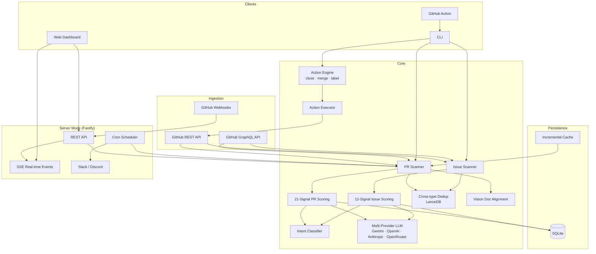

<p align="center">
  
</p>

<h3 align="center">AI-Powered PR & Issue Triage for Maintainers & Enterprise Teams</h3>

<p align="center">
  <em>"Too many open PRs and issues. Which ones should I review, merge, or close first?"</em>
</p>

<p align="center">
  <a href="https://www.npmjs.com/package/treliq"></a>
  <a href="https://www.npmjs.com/package/treliq"></a>
  <a href="https://github.com/mahsumaktas/treliq/actions"></a>
  
  
  
  <a href="LICENSE"></a>
  
  
  <a href="https://github.com/mahsumaktas/treliq/stargazers"></a>
</p>

---

Treliq is an intelligent triage system that **deduplicates, scores, and ranks** pull requests and issues so maintainers can focus on what matters. Auto-close duplicates, auto-merge high-quality PRs, and auto-label by intent. Available as a **CLI tool**, **persistent server with REST API**, and **GitHub Action**.

## The Problem

Existing tools review code (CodeRabbit, Greptile, Copilot). None answer the maintainer's real questions:

- **"These 5 PRs fix the same bug — which one is best?"**
- **"Does this PR align with our roadmap?"**
- **"Show me the top 10 PRs I should review today."**
- **"Which issues have linked PRs? Which are stale?"**
- **"Auto-close all the duplicate PRs and spam issues."**

**Code Review ≠ PR Triage. Treliq fills the gap.**

### 🎯 Who is this for?
- **Enterprise Engineering Teams:** Weekly release cut-offs approaching? Stop guessing which 20 PRs to merge. Treliq prioritizes bug fixes, high test coverage, and small diffs.
- **Open Source Maintainers:** Drowning in open PRs from random contributors? Automatically detect duplicate attempts, filter out spam, and prioritize trusted contributors.
- **Platform/DevOps Teams:** Run Treliq as a central server across multiple internal repositories and provide a unified PR dashboard for the whole company.

### ⚡ Zero Setup / Free Mode
Not ready to trust your codebase with an LLM? Try the 100% free, local heuristic engine with zero API keys required.
```bash
# Score PRs based on 21 signals (CI, coverage, conflicts, intent, etc.) completely locally
npx treliq scan -r owner/repo --no-llm

# Also scan issues alongside PRs
npx treliq scan -r owner/repo --no-llm --include-issues
```

## What's New in v0.7.0

### Accuracy Pipeline (5 New Features)
Code-aware, semantically intelligent scoring — goes beyond metadata to analyze actual diffs:

| Feature | What it does |
|---------|-------------|
| **Diff-Aware Scoring** | Fetches PR diffs, LLM analyzes code quality/risk/change type. New blend: 0.4 heuristic + 0.3 LLM text + 0.3 LLM diff |
| **Intent-Aware Profiles** | 6 hardcoded weight profiles (bugfix, feature, refactor, dependency, docs, chore) adjust signal weights per intent |
| **LLM Dedup Verification** | After embedding clusters, LLM verifies "are these really duplicates?" with subgroup splitting. Max 20 clusters |
| **Issue-PR Semantic Matching** | LLM determines if a PR actually resolves its referenced issue. Bidirectional score impact |
| **Holistic Re-ranking** | Tournament-style: groups of 50 → top 10 per group → final top 15. Cross-item comparison |

All features are LLM-optional — `--no-llm` skips all new stages.

### Intent Classification (Signal #21)
3-tier detection pipeline classifies every PR and issue into one of 6 categories:

| Category | Score | Example |
|----------|-------|---------|
| bugfix | 90 | `fix: resolve memory leak in scanner` |
| feature | 85 | `feat: add dark mode toggle` |
| refactor | 60 | `refactor: extract scoring engine` |
| dependency | 35 | `chore(deps): bump express to v5` |
| docs | 30 | `docs: update API reference` |
| chore | 25 | `ci: add coverage upload step` |

Detection priority: **Conventional commit prefix** (100% confidence) → **LLM classification** (with JSON parsing) → **Heuristic keyword matching** (fallback).

### Full Issue Triage
Issues are now first-class citizens. Scan, score, deduplicate, and take action on issues alongside PRs.

- **`scan-issues` command** — Standalone issue scanning with 12 dedicated signals
- **`--include-issues` flag** — Scan issues alongside PRs in a single `scan` run
- **Cross-type dedup** — PRs and issues embedded in the same vector space; clusters can be `pr`, `issue`, or `mixed`
- **12 Issue Signals**: staleness, body quality, label priority, activity, contributor trust, spam detection, milestone, reactions, linked PR status, assignee, reproducibility info, intent

### Auto-Actions Engine
Two-phase architecture: **ActionEngine** plans actions (pure, testable), **ActionExecutor** executes via GitHub API (re-fetches state before each action).

```bash
# Preview what would happen (dry-run, default)
npx treliq scan -r owner/repo --auto-close-dupes --auto-close-spam --auto-merge --auto-label-intent

# Execute for real
npx treliq scan -r owner/repo --auto-close-dupes --auto-close-spam --auto-merge --auto-label-intent --confirm
```

| Action | Flag | Description |
|--------|------|-------------|
| Close duplicates | `--auto-close-dupes` | Keeps best-scored item in each cluster, closes the rest with comment |
| Close spam | `--auto-close-spam` | Closes items flagged as spam |
| Auto-merge | `--auto-merge` | Merges PRs with score >= threshold, approved, CI pass, no conflicts |
| Label intent | `--auto-label-intent` | Applies `intent:bugfix`, `intent:feature`, etc. labels |

Safety: **dry-run by default**, `--confirm` required for execution, batch limit 50, `--exclude` list, stale state re-check before each action.

### Test Suite (384 tests)
- 140 new tests across 28 test suites
- Accuracy pipeline: DiffAnalyzer (7), IntentProfiles (8), DedupVerification (6), SemanticMatcher (7), HolisticRanker (7), Scoring blend (4)
- Unit tests: IntentClassifier (24), ActionEngine (18), ActionExecutor (18), IssueScoringEngine (14), IssueScanner (6), Issue GraphQL (5), cross-type dedup (4), intent signal (6)
- Integration tests: Issue CRUD in SQLite (5), scoring engine pipeline
- Test fixtures: `createIssueData()`, `createScoredIssue()` factories

---

## What's New in v0.6.0

### Performance Pipeline Redesign
Full rewrite of the scan pipeline for large-scale repos (1000+ PRs). First scan drops from ~140 min to ~15-20 min; incremental scans finish in ~5-8 min.

### Parallel Pipeline
- **Dedup + Vision run concurrently** via `Promise.all` (previously sequential)
- Each stage uses `ConcurrencyController` for internal parallelism

### Batch Embedding
- **Gemini** `batchEmbedContents` API — 100 embeddings per call
- **OpenAI** array input — 100 embeddings per call
- Automatic fallback to parallel individual embedding if batch fails

### RetryableProvider
- New wrapper around any LLM provider with exponential backoff + jitter
- Detects HTTP 429 and respects `Retry-After` headers
- Non-retryable status codes (400/401/403/404/422) fail fast
- `onThrottle` callback wired to adaptive concurrency controllers

### Adaptive Concurrency
- `ConcurrencyController.throttle()` halves parallelism on rate-limit hits
- `ConcurrencyController.recover()` increments back toward initial max
- Shared controllers across dedup + vision, auto-throttled via RetryableProvider

### Expanded Cache
- Embedding vectors and vision results now persisted in cache
- Incremental scans skip re-embedding and re-checking cached PRs
- Compact JSON format (no pretty-print) reduces cache file size

### Test Suite (384 tests)
- 28 test suites, 384/384 passing
- Accuracy pipeline: DiffAnalyzer, IntentProfiles, DedupVerification, SemanticMatcher, HolisticRanker
- RetryableProvider, batch embedding, adaptive concurrency, parallel dedup/vision, expanded cache

---

## What's New in v0.5.1

### 🎯 Model Flexibility
- **`--model` flag** — Choose any model within your provider: `--model claude-sonnet-4-6`
- **`TRELIQ_MODEL` env var** — Set globally without CLI flags
- **Auto max_tokens** — Sonnet/Opus get 1024 tokens (extended thinking), Flash/Haiku get 200

### 🌐 OpenRouter Provider
- Route through OpenRouter for unified billing and 200+ model access
- `--provider openrouter --model anthropic/claude-sonnet-4.5`
- Automatic embedding fallback to Gemini/OpenAI

### 🔗 Embedding Auto-Fallback
- Non-embedding providers (Anthropic, OpenRouter) auto-detect `GEMINI_API_KEY` or `OPENAI_API_KEY`
- Dedup works seamlessly regardless of LLM provider

### 🎯 Scope Coherence Signal (NEW)
- Detects unfocused PRs via directory spread analysis
- Labels: `focused` → `normal` → `mixed` → `scattered`
- Title-to-files mismatch detection (e.g., "fix rate-limit" touching `compaction.ts`)

### 🔬 PR Complexity Signal (NEW)
- Lines-per-file ratio analysis (detects dumped/generated code)
- Size threshold penalties (L/XL/XXL with context)
- AI-generated code detection (`AI assisted`, `copilot`, `cursor`, `chatgpt`)
- Simple title + large diff = overengineered flag
- Test-to-code ratio for large PRs
- Labels: `proportional` → `overengineered` → `massive`

### 📊 Model Benchmark Results
Tested on OpenClaw PRs with 4 models:
| Model | Scoring Style | Best For |
|---|---|---|
| Gemini 2.0 Flash | Generous (85-95) | Free tier, high volume |
| Haiku 4.5 | Balanced (72-92) | Fast, cheap daily scans |
| Sonnet 4.5 | Conservative (72-92) | Accurate triage |
| **Sonnet 4.6** | Most selective | Best quality, vision scoring |

## What's New in v0.5

### 🧪 Test Suite (218 tests)
- 15 test suites covering core modules and integration paths
- Unit tests: 18 scoring signals, concurrency, rate limiting, webhooks, auth, config, cache
- Integration tests: SQLite DB, full scoring engine pipeline
- Test fixtures: `createPRData()`, `createScoredPR()`, `MockLLMProvider`
- Coverage: 85.12% lines, 84.01% statements, 70.08% branches
- CI runs build, lint, and coverage with artifact upload

### 🔒 Security Hardening
- **Rate limiting** — Global 100/min, scan 5/5min (`@fastify/rate-limit`)
- **Security headers** — Helmet CSP, X-Frame-Options, X-Content-Type-Options (`@fastify/helmet`)
- **CORS** — Configurable via `CORS_ORIGINS` environment variable
- **XSS protection** — `escapeHtml()` applied to all 18 innerHTML usages in dashboard
- **SQL injection** — `sortBy` allowlist with 10 safe sort options
- **Timing-safe auth** — Webhook signature verification via `crypto.timingSafeEqual`
- **Input validation** — Fastify JSON Schema with owner/repo pattern validation
- **Error sanitization** — Generic error messages in production mode

### 📋 Structured Logging (Pino)
- 216 `console.error/warn` → Pino structured logging
- 11 source files migrated (CLI output preserved for user-facing commands)
- Dev: colorized pretty-print | Production: JSON format
- Auto-redaction of sensitive fields: `token`, `apiKey`, `privateKey`, `secret`, `password`
- `LOG_LEVEL` and `NODE_ENV` environment variable support

### v0.4 Highlights
- 🖥️ **Server Mode** — Persistent Fastify server with REST API, dashboard UI, and scheduled scanning
- 📡 **Real-time SSE** — Live dashboard updates via Server-Sent Events
- 🔗 **GitHub Webhooks** — Auto-score PRs on open/update/close with HMAC-SHA256 verification
- 🔍 **GraphQL Fetching** — ~80% fewer API calls using GitHub's GraphQL API
- 📊 **21-Signal Scoring** — Includes Scope Coherence, PR Complexity, and Intent analysis
- 🗄️ **SQLite Persistence** — Full scan history, PR state tracking, repository management
- ⚡ **Parallel LLM Scoring** — Concurrency-controlled parallel scoring with configurable limits
- 🚦 **Rate Limit Manager** — Intelligent GitHub API pacing with automatic backoff
- ⏰ **Cron Scheduler** — Automatic periodic scanning with Slack/Discord notifications
- 📢 **Notifications** — Slack and Discord webhook integration for scan results and high-priority PRs

## Dashboard

**[Live Demo →](https://mahsumaktas.github.io/treliq/)**

<p align="center">
  
</p>

- 100 PRs scored and ranked at a glance
- Sidebar navigation: Overview, Pull Requests, Clusters
- Score distribution chart (High/Medium/Low)
- Duplicate cluster visualization with similarity percentages
- Spam detection, conflict status, LLM risk assessment
- Tokyo Night dark theme with light mode toggle

## Architecture



## Quick Start

### Install

```bash
# Global install
npm install -g treliq

# Or run directly with npx (no install needed)
npx treliq@latest --help
```

### CLI Mode

```bash
# Score a single PR
npx treliq score -r owner/repo -n 123 -f markdown

# Scan all open PRs (up to 100)
npx treliq scan -r owner/repo -m 100 -f json

# Scan PRs + Issues together
npx treliq scan -r owner/repo --include-issues -f json

# Scan only issues
npx treliq scan-issues -r owner/repo -m 200 -f table

# Find duplicate PR clusters
npx treliq dedup -r owner/repo

# Trust known contributors (exempt from spam detection)
npx treliq scan -r owner/repo --trust-contributors
```

### Auto-Actions

```bash
# Preview auto-actions (dry-run — safe, no changes made)
npx treliq scan -r owner/repo \
  --auto-close-dupes \
  --auto-close-spam \
  --auto-merge --merge-threshold 90 --merge-method squash \
  --auto-label-intent

# Execute auto-actions for real
npx treliq scan -r owner/repo \
  --auto-close-dupes --auto-close-spam --auto-merge \
  --auto-label-intent --confirm

# Exclude specific items from auto-actions
npx treliq scan -r owner/repo --auto-close-dupes --confirm --exclude 42,99,101
```

### Server Mode

```bash
# Start server with dashboard on port 4747
npx treliq server -r owner/repo -p 4747

# With webhooks and scheduled scanning
npx treliq server -r owner/repo -p 4747 \
  --webhook-secret $WEBHOOK_SECRET \
  --schedule "0 */6 * * *" \
  --slack-webhook $SLACK_URL

# With multiple scheduled repositories
npx treliq server -r owner/repo -p 4747 \
  --schedule "0 8 * * *" \
  --scheduled-repos "org/repo1,org/repo2"
```

The server exposes:

| Endpoint | Description |
|----------|-------------|
| `GET /` | Dashboard UI |
| `GET /health` | Health check |
| `GET /api/repos` | List tracked repositories |
| `GET /api/repos/:owner/:repo/prs` | List scored PRs (sortable, filterable) |
| `GET /api/repos/:owner/:repo/prs/:number` | Single PR details |
| `POST /api/repos/:owner/:repo/scan` | Trigger a new scan |
| `GET /api/repos/:owner/:repo/scans` | Scan history |
| `GET /api/repos/:owner/:repo/spam` | Spam PRs |
| `GET /api/repos/:owner/:repo/issues` | List scored issues (sortable, filterable) |
| `GET /api/events` | SSE real-time stream |
| `POST /webhooks` | GitHub webhook receiver |
| `GET /setup` | GitHub App setup guide |

### Multi-Provider LLM

```bash
# Default: Gemini Flash (free)
npx treliq scan -r owner/repo

# Choose a specific model
npx treliq scan -r owner/repo -p anthropic --model claude-sonnet-4-6

# OpenRouter (200+ models, unified billing)
npx treliq scan -r owner/repo -p openrouter --model anthropic/claude-sonnet-4.5

# OpenAI
npx treliq scan -r owner/repo -p openai --api-key sk-...

# Anthropic (embeddings auto-fallback to Gemini/OpenAI)
npx treliq scan -r owner/repo -p anthropic --api-key sk-ant-...

# Heuristic-only (no API keys needed, 21 signals)
npx treliq scan -r owner/repo --no-llm
```

### 🔧 Setup (recommended)

```bash
npx treliq init
```

`treliq init` runs an interactive setup wizard, validates your GitHub token, prompts for provider keys, and saves everything to `.treliq.yaml`.

### 🆓 Free Mode (no API keys needed)

```bash
# See example output
npx treliq demo

# Heuristic-only scoring (21 signals, no LLM)
npx treliq scan -r owner/repo --no-llm
```

### 🤖 GitHub Action

1. Copy this workflow into `.github/workflows/treliq.yml`.
2. Add the `GEMINI_API_KEY` repository secret.
3. Open or update a PR and Treliq will auto-score it.

```yaml
name: Treliq PR Triage
on:
  pull_request:
    types: [opened, synchronize, reopened]

permissions:
  contents: read
  pull-requests: write
  issues: write

jobs:
  triage:
    runs-on: ubuntu-latest
    steps:
      - uses: actions/checkout@v4
      - uses: actions/setup-node@v4
        with:
          node-version: 20
      - run: npm install -g treliq@latest
      - name: Score PR
        id: score
        env:
          GITHUB_TOKEN: ${{ secrets.GITHUB_TOKEN }}
          GEMINI_API_KEY: ${{ secrets.GEMINI_API_KEY }}
        run: |
          BODY=$(treliq score -r ${{ github.repository }} -n ${{ github.event.pull_request.number }} -f markdown)
          echo "body<<EOF" >> $GITHUB_OUTPUT
          echo "$BODY" >> $GITHUB_OUTPUT
          echo "EOF" >> $GITHUB_OUTPUT
      - uses: actions/github-script@v7
        env:
          SCORE_BODY: ${{ steps.score.outputs.body }}
        with:
          script: |
            await github.rest.issues.createComment({
              owner: context.repo.owner,
              repo: context.repo.repo,
              issue_number: context.payload.pull_request.number,
              body: process.env.SCORE_BODY,
            });
```

## 21-Signal PR Scoring

| # | Signal | Weight | Description |
|---|--------|--------|-------------|
| 1 | CI Status | 0.15 | Pass / fail / pending from GitHub Checks |
| 2 | Test Coverage | 0.12 | Whether test files changed alongside code |
| 3 | Merge Conflicts | 0.12 | Mergeable / conflicting / unknown |
| 4 | Contributor Trust | 0.12 | Author association + reputation score |
| 5 | Spam Detection | 0.12 | Tiny diff, docs-only, AI language markers |
| 6 | Draft Status | 0.08 | Draft PRs deprioritized |
| 7 | Review Status | 0.08 | Approved / changes requested / commented |
| 8 | Label Priority | 0.08 | High-priority labels boosted (p0, critical, security) |
| 9 | Milestone | 0.07 | PRs attached to milestones score higher |
| 10 | Diff Size | 0.07 | Lines changed — penalizes extremes |
| 11 | Staleness | 0.07 | Days since opened — fresh PRs preferred |
| 12 | Issue References | 0.07 | Links to issues via `Fixes #123` |
| 13 | CODEOWNERS | 0.05 | Author owns affected code paths |
| 14 | Requested Reviewers | 0.05 | Reviewers assigned signals process maturity |
| 15 | Commit Quality | 0.04 | Conventional commit format |
| 16 | Body Quality | 0.04 | Description length, checklists, screenshots |
| 17 | Activity | 0.04 | Comment count — engagement signal |
| 18 | Breaking Change | 0.04 | Risky files, large deletions, `!:` in title |
| 19 | Scope Coherence | 0.06 | Directory spread, title-to-files alignment |
| 20 | PR Complexity | 0.05 | Size analysis, AI detection, overengineering |
| 21 | **Intent** | 0.08 | bugfix/feature/refactor/dependency/docs/chore classification |

When an LLM provider is configured, a **quality score** (0–100) is blended at **60% LLM / 40% heuristic**.

### 12-Signal Issue Scoring

| # | Signal | Weight | Description |
|---|--------|--------|-------------|
| 1 | Staleness | 0.08 | Days since opened — fresh issues preferred |
| 2 | Body Quality | 0.08 | Description length, checklists |
| 3 | Label Priority | 0.07–0.10 | High-priority labels (bug, p0, security) boosted |
| 4 | Activity | 0.08 | Comment count — engagement signal |
| 5 | Contributor Trust | 0.08 | Author association (owner/member/contributor) |
| 6 | Spam Detection | 0.10 | Empty body, short title, AI language markers |
| 7 | Milestone | 0.07 | Issues attached to milestones score higher |
| 8 | Reactions | 0.10 | Community interest via emoji reactions |
| 9 | Linked PR | 0.08 | Has linked PR(s) attempting to resolve |
| 10 | Assignee | 0.07 | Assigned = someone is working on it |
| 11 | Reproducibility | 0.07 | Steps to reproduce, expected/actual, code blocks |
| 12 | Intent | 0.09 | bugfix/feature/refactor/dependency/docs/chore |

## Configuration

### Environment Variables

| Variable | Provider | Required For |
|----------|----------|-------------|
| `GITHUB_TOKEN` | GitHub | All commands |
| `GEMINI_API_KEY` | Gemini (default) | LLM scoring, embeddings, vision |
| `OPENAI_API_KEY` | OpenAI | LLM scoring, embeddings |
| `ANTHROPIC_API_KEY` | Anthropic | LLM scoring (embeddings via fallback) |
| `OPENROUTER_API_KEY` | OpenRouter | Multi-model gateway (200+ models) |
| `TRELIQ_MODEL` | Any | Override default model for any provider |

### Server Configuration

| Flag | Default | Description |
|------|---------|-------------|
| `-p, --port` | `4747` | Server port |
| `--host` | `0.0.0.0` | Bind address |
| `--webhook-secret` | — | GitHub webhook HMAC secret |
| `--schedule` | — | Cron expression for auto-scanning |
| `--scheduled-repos` | — | Comma-separated repos to scan on schedule |
| `--slack-webhook` | — | Slack notification webhook URL |
| `--discord-webhook` | — | Discord notification webhook URL |

## SSE Real-time Events

Connect to `/api/events` for live updates:

```javascript
const events = new EventSource('http://localhost:4747/api/events');

events.addEventListener('scan_start', (e) => {
  console.log('Scan started:', JSON.parse(e.data));
});

events.addEventListener('scan_complete', (e) => {
  const { repo, totalPRs, spamCount } = JSON.parse(e.data);
  console.log(`Scanned ${totalPRs} PRs, ${spamCount} spam`);
});

events.addEventListener('pr_scored', (e) => {
  const { prNumber, totalScore } = JSON.parse(e.data);
  console.log(`PR #${prNumber} scored ${totalScore}/100`);
});
```

## Webhook Integration

1. Create a GitHub App or webhook at **Settings → Webhooks**
2. Set URL to `https://your-server/webhooks`
3. Set content type to `application/json`
4. Select events: `Pull requests`
5. Start server with `--webhook-secret YOUR_SECRET`

Treliq automatically scores PRs on `opened`, re-scores on `synchronize`, and updates state on `closed`/`reopened`.

## Inspired By

| Tool | What We Learned |
|------|----------------|
| [Qodo PR-Agent](https://github.com/qodo-ai/pr-agent) | `/review` command pattern |
| [Greptile](https://greptile.com) | Full codebase context matters |
| [ai-duplicate-detector](https://github.com/mackgorski/ai-duplicate-detector) | Embedding threshold system |

## Contributing

Contributions welcome! Please:

1. Fork the repository
2. Create a feature branch (`git checkout -b feat/amazing-feature`)
3. Use conventional commits (`feat:`, `fix:`, `docs:`, etc.)
4. Add tests for new functionality
5. Open a PR — Treliq will score it automatically 😉

See [CONTRIBUTING.md](CONTRIBUTING.md) for detailed guidelines.

## License

MIT © [Mahsum Aktaş](https://github.com/mahsumaktas)

---

<p align="center">
  <em>Built because 3,100 PRs and 2,000 issues won't triage themselves.</em>
</p>
<!-- webhook test Sun Feb 22 03:35:33 +03 2026 -->
