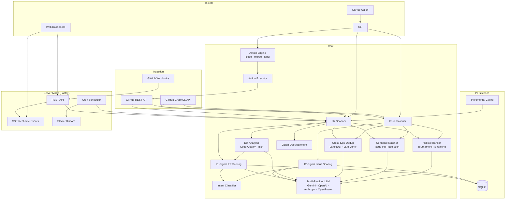

# Treliq Architecture

## Pipeline Flow

```
Fetch PRs/Issues (GitHub GraphQL + REST)
  -> Score (21 PR signals / 12 issue signals + intent profiles)
  -> Diff Analysis (LLM code quality + risk assessment)
  -> LLM Blend (0.4 heuristic + 0.3 LLM text + 0.3 LLM diff)
  -> Dedup (LanceDB embeddings + LLM verification)
  -> Vision Check (document alignment)
  -> Semantic Matching (issue-PR resolution)
  -> Holistic Re-ranking (tournament-style top-N)
  -> Auto-Actions (close dupes/spam, merge, label)
  -> Output (table / JSON / markdown / dashboard / SSE)
```

## Component Diagram



## Source Layout

```
src/
  index.ts              Main exports
  cli.ts                CLI entry point (Commander.js)
  core/
    types.ts            Type definitions (PRData, ScoredPR, SignalScore)
    scanner.ts          GitHub PR fetcher (GraphQL + REST)
    scoring.ts          Multi-signal scoring engine (21 signals, TOPSIS, cascade)
    dedup.ts            Duplicate detection (LanceDB + LLM verify)
    vision.ts           Vision document alignment
    intent.ts           Intent classifier (conventional commit / LLM / heuristic)
    issue-scorer.ts     12-signal issue scoring
    diff-analyzer.ts    Code quality analysis via diff
    semantic-matcher.ts Issue-PR matching via LLM
    holistic-ranker.ts  Tournament-style re-ranking
    db.ts               SQLite persistence (WAL mode)
    provider.ts         LLM provider abstraction
    graphql.ts          GitHub GraphQL queries
    logger.ts           Pino structured logging
    cache.ts            Incremental cache (embeddings, vision, scores)
    ratelimit.ts        GitHub API rate limiting
    vectorstore.ts      LanceDB wrapper
    retryable-provider.ts  Exponential backoff + jitter
    concurrency.ts      Semaphore-based throttling
    auth.ts             GitHub auth (token + App)
    actions.ts          Auto-close, auto-merge, auto-label planning
    action-executor.ts  GitHub API execution layer
    notifications.ts    Slack / Discord webhooks
  server/
    index.ts            Server entry point
    app.ts              Fastify routes + middleware
    webhooks.ts         GitHub webhook handler
    scheduler.ts        Cron job scheduler
    sse.ts              Server-Sent Events
```

## Key Design Decisions

- **TOPSIS** for heuristic readiness scoring (multi-criteria decision method, better than weighted average)
- **CheckEval binary checklist** for LLM scoring (evidence: CheckEval EMNLP 2025)
- **Cascade pipeline** for cost optimization (skip LLM for low-value PRs)
- **Idea-first scoring**: `totalScore = 0.7 * ideaScore + 0.3 * implementationScore` — a PR with a great idea but poor code is more valuable than perfect code solving nothing
- **Cross-type dedup**: PRs and issues embedded in the same vector space for unified duplicate detection
- **Tournament re-ranking**: Groups of 50 -> LLM picks top 10 -> finalists -> top 15 (mitigates LLM position bias)
